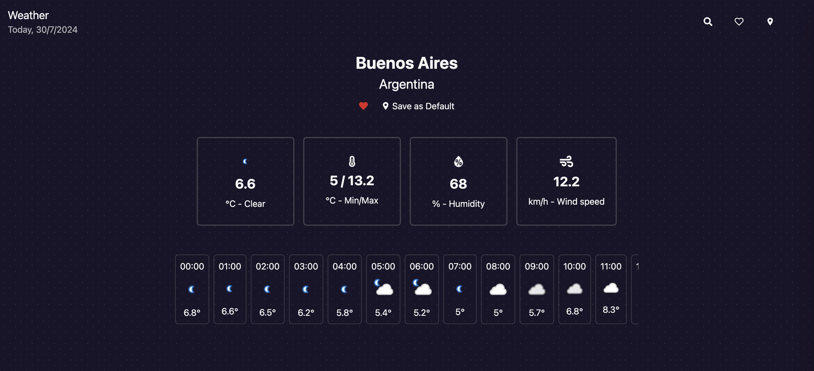
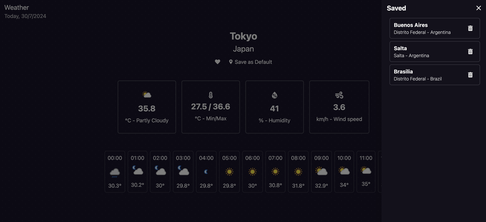

# WeatherApp Frontend

WeatherApp es una aplicación que permite a los usuarios ver el pronóstico del tiempo para su ubicación actual, guardar ubicaciones en favoritos y buscar otras ubicaciones utilizando un debouncer.

## Características

- Ver el pronóstico del tiempo para tu ubicación actual (geolocalización).



- Guardar ubicaciones en favoritos.



- Buscar ubicaciones utilizando un debouncer para mejorar la experiencia del usuario.
- Interfaz responsive para una experiencia óptima en diferentes dispositivos.

## Tecnologías Utilizadas

- **React**: Biblioteca de JavaScript para construir interfaces de usuario.
- **React Router**: Biblioteca para el manejo de rutas en aplicaciones React.
- **React Spinner**: Biblioteca para mostrar indicadores de carga.
- **React Icons**: Biblioteca de iconos para React.
- **Tanstack Query**: Biblioteca para la gestión de datos asíncronos en React.

## Requisitos Previos

Antes de comenzar, asegúrate de tener instalado lo siguiente en tu máquina:

- Node.js (v14 o superior)
- npm (v6 o superior) o Yarn (opcional)

## Instalación

1. **Clonar el repositorio:**

   ```sh
   git clone https://github.com/martinnbejarano/weather.git
   cd weather
   ```

2. **Configurar Variables de Entorno:**

   Crea un archivo `.env` en la raíz del proyecto y agrega la variable de entorno de weatherapi de rapidapi.com:

   ```env
   VITE_RAPIDAPI_KEY=XXXXXXXXX
   ```

3. **Ejecucion:**
   ```sh
   npm run dev
   ```
